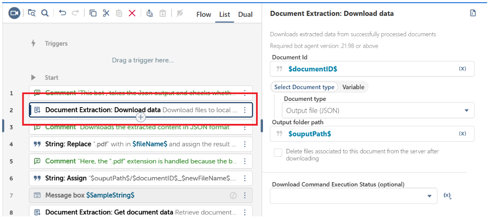
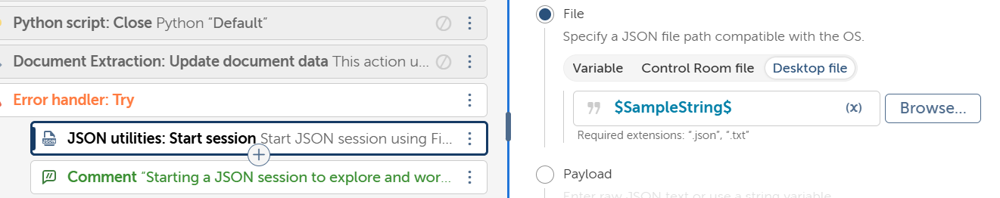
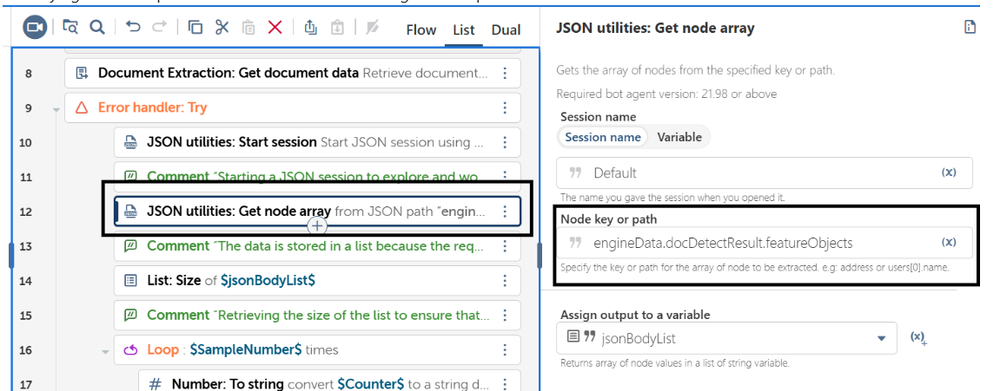
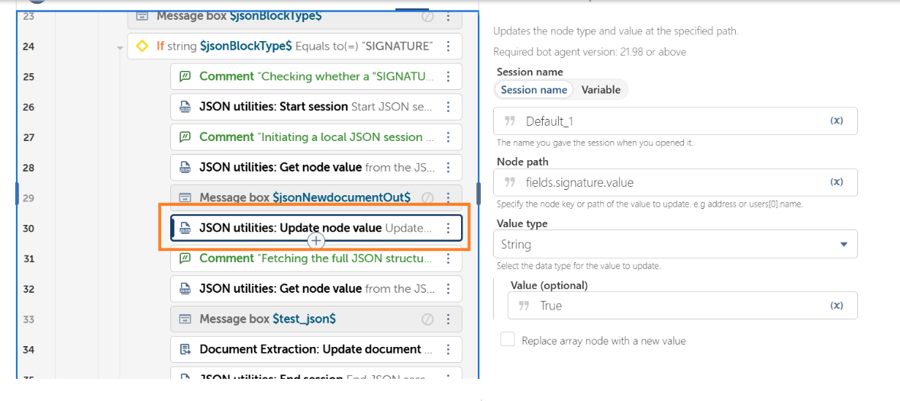
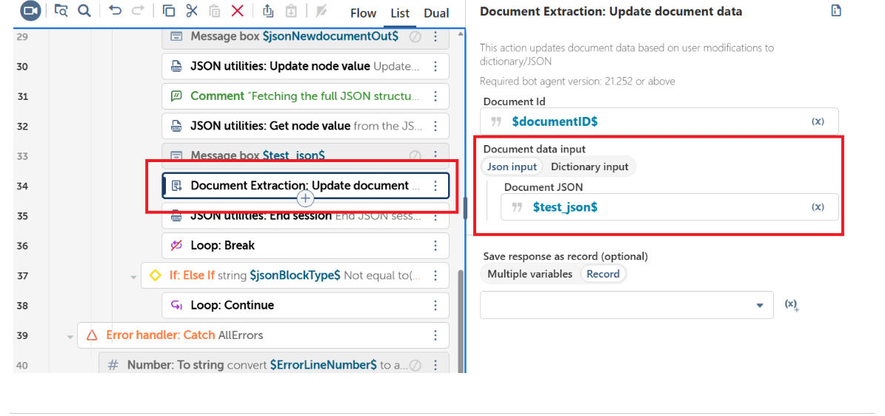
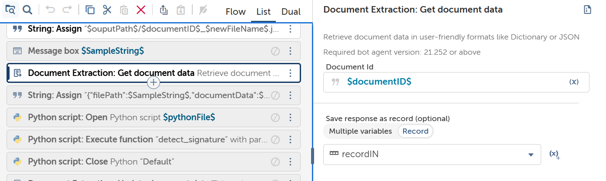
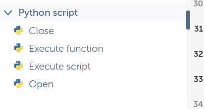

# Digital Signature Detection Bot (Without GenAI)

This bot determines whether a digital signature is present in a document processed through **Document Extraction** without using any Generative AI capabilities.

The solution works by analyzing the JSON output generated by Document Extraction and checking whether a **SIGNATURE** block exists within the OCR-detected feature objects.

---

## Overview

The bot performs the following actions:

1. Processes documents using a configured Learning Instance.
2. Downloads the extracted content in JSON format.
3. Reads the generated JSON output.
4. Identifies the OCR-detected feature blocks.
5. Iterates through all feature blocks.
6. Checks whether any block is classified as a **SIGNATURE**.
7. Updates the JSON with the signature detection result.

---

## Prerequisites

Before deploying this bot, ensure the following are available:

- Bot Creator License
- Document Extraction package
- Published Learning Instance
- Extracted content configured to download in JSON format
- Local or shared folder path accessible by the Bot Runner
- Necessary permissions to read and write files

---

## Bot Runner Prerequisites

The Bot Runner must have:

- Access to Automation Anywhere Control Room
- Access to the configured Learning Instance
- Permission to read input documents
- Permission to write JSON output files
- Required bot packages imported into the environment

---

# Problem Statement

How to verify if a digital signature is present in a document?

# Proposed Solution

We can find it by using Automation Anywhere's Document Extraction . Then by using JSON Utils action or python action 


# How Signature Detection Works by using JSON utils action


## Step 1: Configure Document Extraction  Download action to JSON Output

Inside the Document Extraction action, configure the Learning Instance to download extracted content in **JSON format**.


The JSON output generated by Document Extraction contains OCR metadata and feature-detection information required to identify signatures.

## Step 2: Start a JSON session

Start a json session with the download file path



## Step 3: Locate the Feature Objects Path


The JSON path that contains OCR-detected feature blocks is:

```json
engineData.docDetectResult.featureObjects
```

This path returns a list of detected feature blocks present in the document.

### Example

```json
{
  "engineData": {
    "docDetectResult": {
      "featureObjects": [
        {
          "blockType": "TEXT"
        },
        {
          "blockType": "SIGNATURE"
        }
      ]
    }
  }
}
```


## Step 4: Iterate Through the Feature Objects List

The bot retrieves all items from:

```json
engineData.docDetectResult.featureObjects
```

Since this path returns a list, the bot iterates through each element using a counter variable.

For every iteration, the following JSON path is evaluated:

```json
engineData.docDetectResult.featureObjects.[$counterVariableString$].blockType
```

Where:

```text
counterVariableString = 0, 1, 2, 3, ...
```

The `blockType` value identifies the category of OCR-detected content.

Examples:

```text
TEXT
TABLE
CHECKBOX
SIGNATURE
```


## Step 5: Check for a SIGNATURE Block

During the loop, the bot evaluates the following condition:

```text
If engineData.docDetectResult.featureObjects.[$counterVariableString$].blockType == "SIGNATURE"
```

If the condition evaluates to True, a signature block has been detected.

### Logic Used

```text
Loop through all items in featureObjects

    Read blockType

    If blockType equals SIGNATURE

        signatureDetected = true

        Exit Loop

    End If

End Loop
```


## Step 6: Update the Detection Result

When a SIGNATURE block is found:

```json
{
  "signatureDetected": true
}
```

If no SIGNATURE block exists after iterating through the entire list:

```json
{
  "signatureDetected": false
}
```

The bot updates the output JSON with the final signature detection status.




## How to Run This Bot

1. Open Automation Anywhere Control Room.
2. Import the bot package:

```text
bot.zip
```

3. Open the bot and verify that the Learning Instance is configured to download extracted content in JSON format.
4. Configure a valid local or shared folder path for JSON output.
5. Place the document to be processed in the configured input location.
6. Run the bot.
7. Review the output JSON to determine whether a signature was detected.


## Notes

- This solution is completely rule-based and does not use Generative AI.
- Signature detection depends on the OCR-generated feature objects returned by Document Extraction.
- The bot identifies signatures by checking whether any feature object contains:

```json
{
  "blockType": "SIGNATURE"
}
```

- Once a SIGNATURE block is detected, the bot can immediately mark the document as containing a signature and stop further validation if desired.
- Ensure the JSON output location is accessible to the Bot Runner during execution.
- Accuracy depends on the Document Extraction engine correctly identifying signatures as SIGNATURE blocks.

# How to do this using python script.


The logic will be the same ,only the way implemented is different.

## Step 1: Combine Multiple Inputs into a Single Parameter

First we will download the Output of Document Extraction as JSON . Then uses this file as one parameter.

Then we get the json which is requried for to update the bot.



The Python Action in Automation Anywhere can accept only one function and one input parameter. In this use case, we need to pass two separate pieces of information to the Python script:

The file path of the Document Extraction JSON output.
The documentData JSON that needs to be updated with the signature detection result.

To achieve this, use a String Assignment action to create a single JSON string that contains both values.

``` json
{"filePath":$SampleString$,"documentData":$recordIN{documentJSON}$}
```


## Step 2 : Using Python Action

Sending the output to the python function




## Step 3: Updating the Document

Taking the output of the python function and updating it.


## Note

Python function : signatureDetection.py